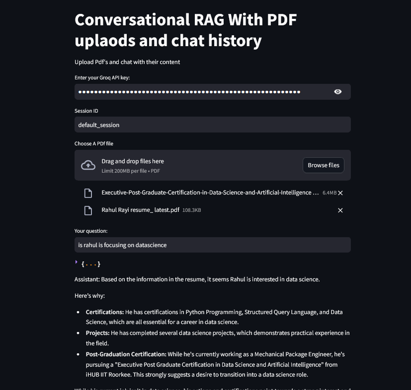

# RahulRayi777-Conversational-RAG-With-PDF-uploads-and-chat-history
In this project, users can upload files (such as PDFs), and the chatbot uses the content of those files to provide conversational responses. The conversation is context-aware, meaning that it includes both the file content and the ongoing chat history to improve the relevance of the chatbot's replies.For creating this chatbot i used chatgroq(Gemma2-9b-It) model and for creating embedding initially i used hugging face embeddings (all-MiniLM-L6-v2) model .

